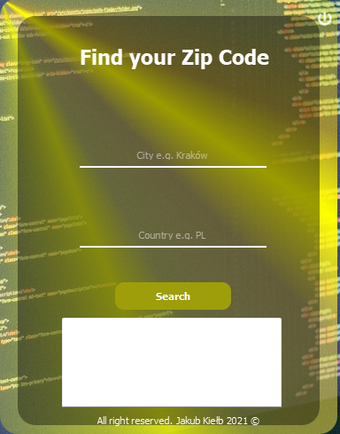

# [Zip Code API](https://zipcodebase.com)

\

\
\


```python
import requests

headers = { 
  "apikey": "YOUR-APIKEY"}

params = (
   ("city","Amsterdam"),
   ("state_name","Noord-Holland"),
   ("country","nl"),
);

response = requests.get('https://app.zipcodebase.com/api/v1/code/city', headers=headers, params=params);
print(response.text)
```


